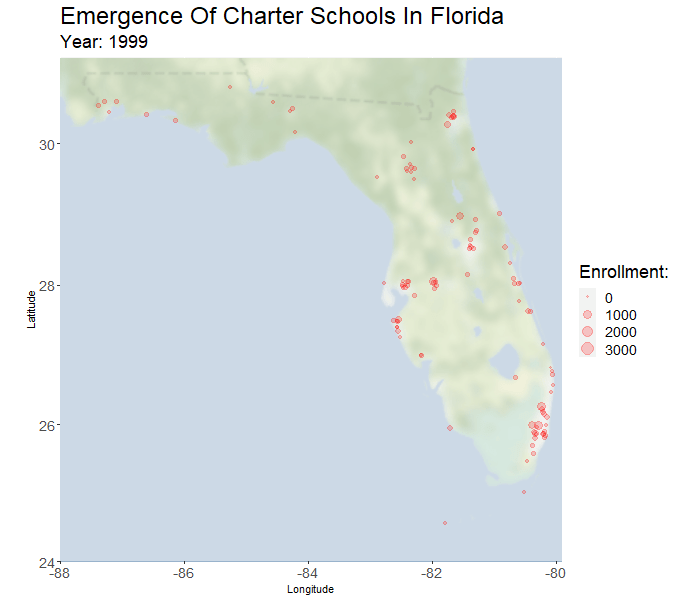
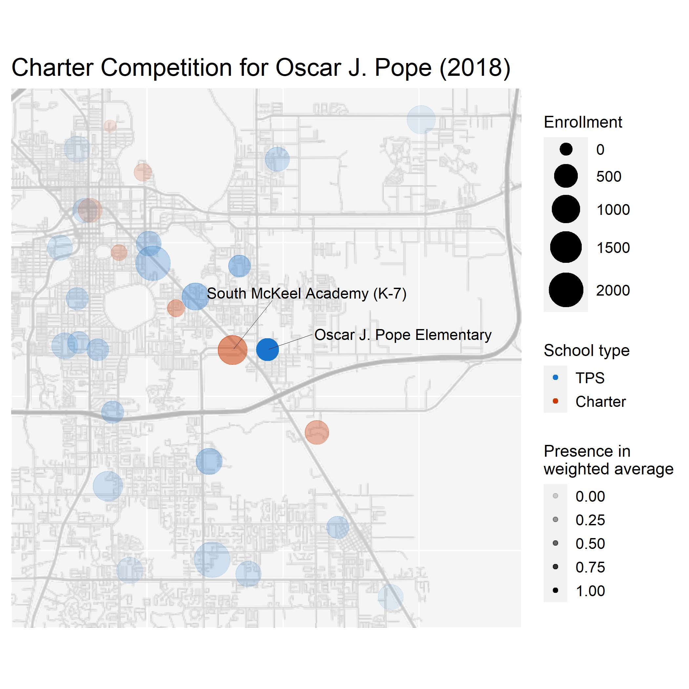
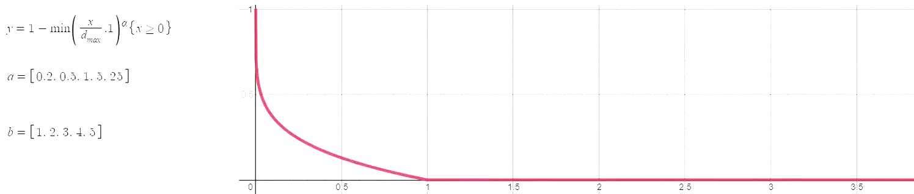

# Abstract
In the past ~20 years there has been tremendous adoption of charter schools in Florida. The percent of students in charter schools has grown by a factor of 14 (from 0.75% in 1999 to 10.8% in 2018). Support for charter education in Florida is political and divisive. Effects of charter presence on the performance of nearby traditional public schools (TPS) is a point of contention that has not been thoroughly studied in Florida, and the related literature is not always informative. One of the core objectives of this research is to address the existence and nature of these effects. 

------

     

## My Contribution to the Research
Over the past two and a half years I have been responsible for developing the technology to analyze the effects of charter competition on neighboring TPS. The work was under the supervision of Dr. Jim Dewey, but largely independent. My purpose is to inform research questions that are not fully addressed in the literature:
- When a new charter school opens, closes, grows, or shrinks in Florida does it have time-series effects on neighboring TPS?
- What are the nature of these effects, if any?

## General Overview
- Extract data from multiple multiple public sources, and make sure the files stay current. 
- Combine the data, perform general cleaning steps, and homogenize key features that will be used later on. Exclude institutions that are not relevant to the study, or that do not provide enough data. 
- Provide accurate location data for the schools. This is tricky because the data from public sources is not reliable. Since schools can change location several times or close, looking up their current location is not a valid approach. I used a hierarchical clustering model and fuzzy string matching, and cross-referenced it with Google Maps when possible. 
- Create a representative measure of charter competition. There are many ways to approach this, and most comparable literature uses simplified metrics that are less accurate. The linear algebra approach we settled on takes the product of distance and enrollment of all surrounding schools, fits a curving function with the best hyperparameters, and then sums these values. 
- Produce time-series models to explore the effects of charter school presence. This required a custom implementation of leave-one-out-cross-validation to improve runtime.

## Competition Measure Used
The measure of charter presence/competition was selected very carefully. It addresses features of the data that are mostly neglected in the literature. Generally, studies will take a fixed radius surrounding each TPS (e.g. 5 miles) and calculate charter_enrollment/total_enrollment. We have embedded two additional assumptions in our metric: 
1. Grade level. Charter high-schools do not compete with surrounding elementary schools.
2. Proximity. A charter school across the street from a TPS provides more competition than a charter school 4 miles away (with all else constant). 

The resulting measure reflects the data more accurately by using a curve function on distance instead of a hard cutoff, and by considering gradewise enrollment. The image below should provide a perspective on what the computer sees when looking at a particular TPS (Oscar J. Pope) in a given year (2018). 

     

Right across the street from Oscar J. Pope is South McKeel Academy, a high-enrollment charter school. Both schools educate at similar grade levels (K-5 v.s. K-7). Note that McKeel is weighted more than other high-enrollment schools due to its proximity. In general, schools further away receive less weight, as do schools with non-similar grade levels. There is some elegant matrix math that makes this computation very efficient, since the final dataset contains both distance and gradewise enrollment.

The hyperparameters of this plot have been selected as (max_distance=4, alpha=0.3), which means the following:
- At a distance greater than 4 miles a school's weight is 0. 
- Schools closer to the max distance (4 miles in this case) have a weight close to 0, and schools closer to Oscar J. Pope have a weight close to 1. In other words, the curve function is concave, which corresponds to alpha < 1. 

When alpha is greater than 1 the curve is convex, meaning that almost all schools will have a weight close to 1. Several pairs of the best hyperparameters were selected with a grid search. Hopefully the image below provides a bit of an intuition for the potential relationships between distance (x-axis) and weight (y-axis).

     
     
    <i>Curve function used to produce a continuous measure of charter presence/competition</i>

## Technologies Used
- R (tidyverse, data.table, plm, stringdist, ggplot)
- Stata
- Google Cloud Platform API
- Unsupervised machine learning (hierarchical clustering)
- Computational linear algebra (sparse matrices, distributed computing, analytic LOOCV)
- Time-series regression 
- Text processing & fuzzy string matching

## Data Sources

[Data Dictionary](https://docs.google.com/spreadsheets/d/1w-w7T3FAB0RLbvLk99KsqqPeYc_2AcSK3gtDrOsGLI0/edit#gid=188439690)

All sources will eventually contain data 1999 through 2018, some are currently a year or two behind 2018. 2019 omitted due to pandemic. 

**Urban Institute Dataset** (https://educationdata.urban.org/data-explorer/schools/) downloaded 06/04/20 
Most information comes from the common core of data [partial data dictionary](https://nces.ed.gov/ccd/psadd.asp)
contains general information about:
- enrollment
- lowest/highest grade offered
- charter status
- virtual status
- latitude & longitude

**Latitude & Longitude** Pulled from one file from ELSI, source of coordinates is CCD
(https://nces.ed.gov/ccd/elsi/) downloaded 06/15/20

**Grade-wise enrollment** Pulled as four separate files from ELSI table generator, then combined 
(https://nces.ed.gov/ccd/elsi/) downloaded 06/05/20

**School grades datasets** (http://www.fldoe.org/accountability/accountability-reporting/school-grades/archives.stml)
1999 - 2017
- Test scores
- School grade

**Student demographics** (https://nces.ed.gov/ccd/elsi/tableGenerator.aspx)
1997 - 2016
- Total enrollment
- Highest and lowest grade
- Teachers & pupil teacher ratio

## Manual Data Cleaning

**src/school_types_include.csv**  
This is a subset of the schools that were not easily classifiable as charter/non-charter and as regular/non-regular in the data. For each school in this list discretion was used to determine if a school is to be included in the study. For some schools only certain years are excluded. The aim is to only include charter schools and traditional public schools in years that they were operational. 

**src/manually_corrected_locations.csv** 
